# Proxy

Després d'haver instal·lat el proxy, entrarem en el panel i veurem tota la informació.

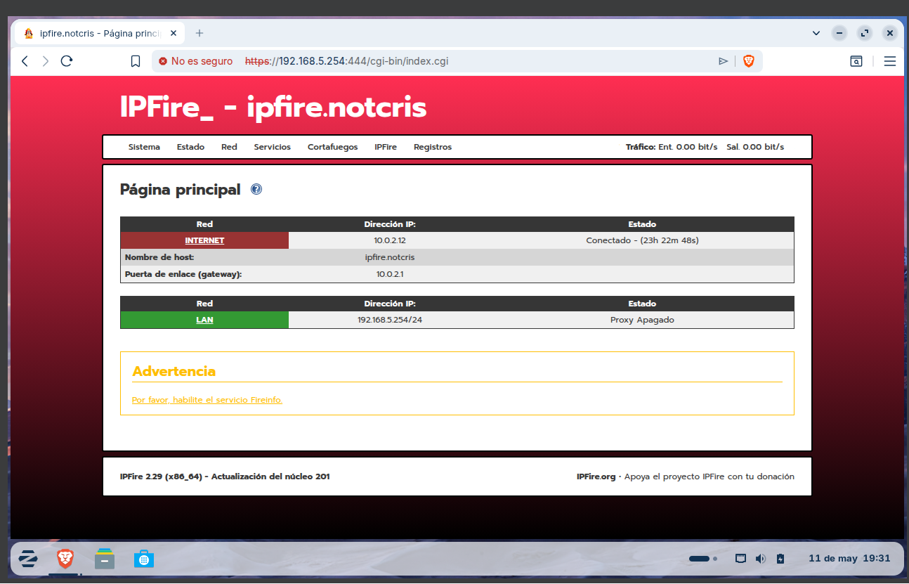

El primer serà fer la configuració bàsica. Que farem serà activar el proxy, configurar el port i podem configurar més coses com idioma de missatge d'error, el disseny, etc. Després activarem el filtre d'URL. 

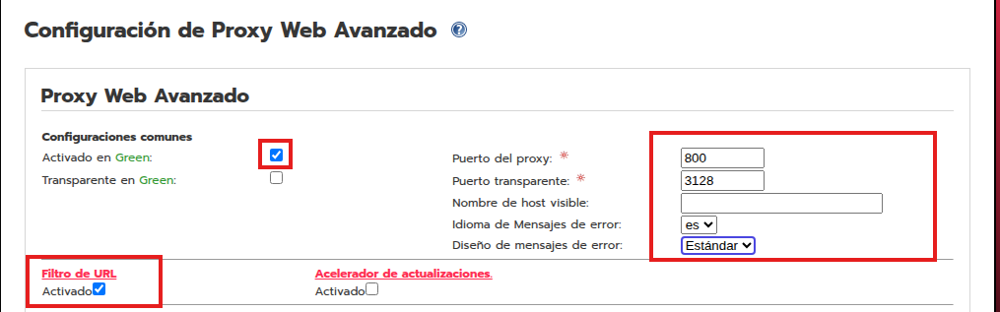

Despres hem de configurar el proxy en els navegadors. Per això, anirem a les opcions de connexió i configurarem el proxy. Posarem les IPs i el port que hem configurat abans.

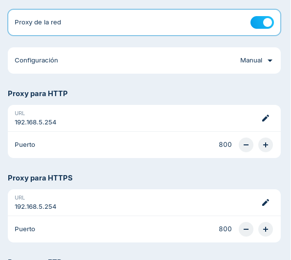

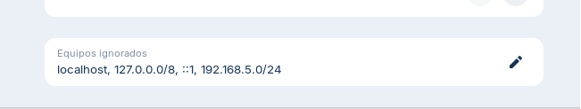

## Instal·lació de llistes negres 

Entrarem a filtres d'URL, anirem a l'apartat per importar les llistes negres perquè no les tenim.

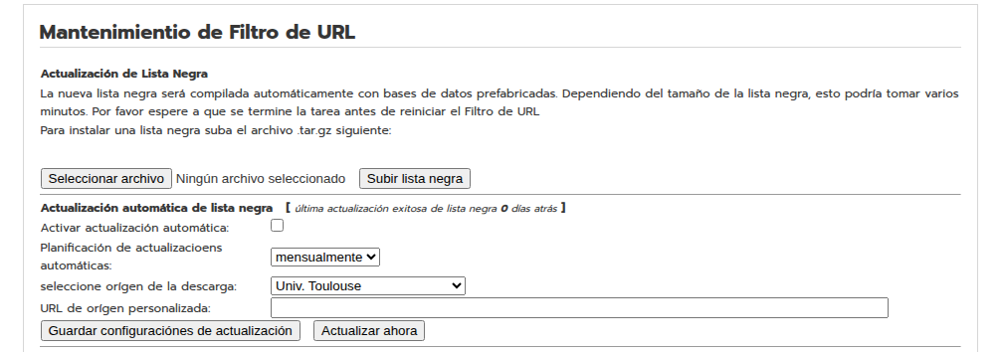

Les descarreguem d'alguna web i les importem al proxy.

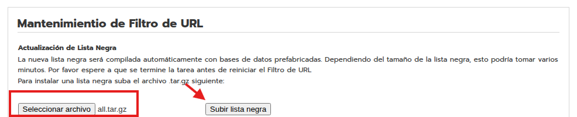

Aqui podem veure que ja les tenim importades i les podem activar. Podem veure que tenim moltes categories, com per exemple: pornografia, drogues, armes, etc.

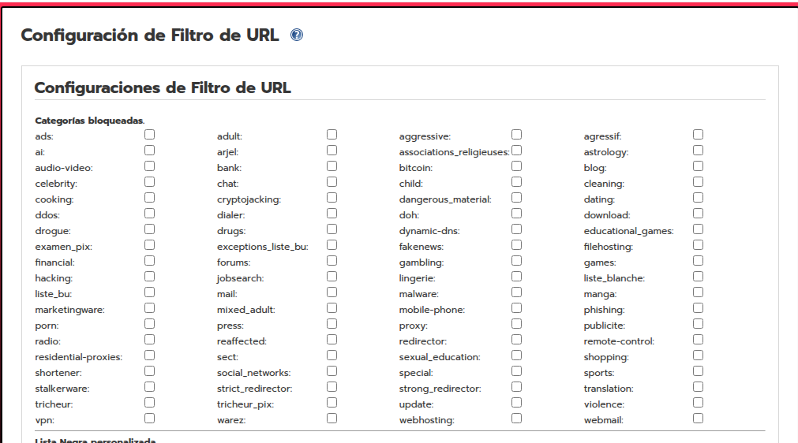

## Filtrat per categories (Bank i Radio) 

Per provar el filtrat per categories, activarem les categories de Bank i Radio. I haurem de reiniciar el proxy perquè els canvis tinguin efecte.

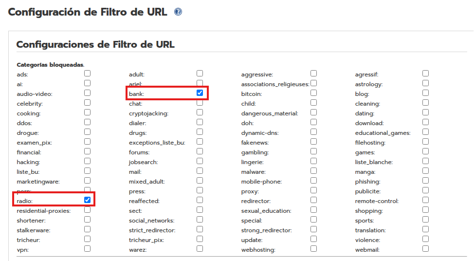

Entrem a la primera pàgina que és ing.es. I veurem que ens apareix un missatge d'error, ja que està bloquejada per la categoria de Bank. 

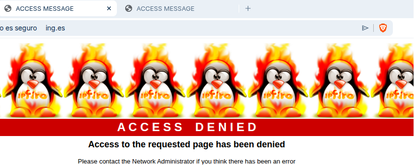

Després entrem a la pàgina de ràdio que és ah.fm i veiem que també està bloquejada.

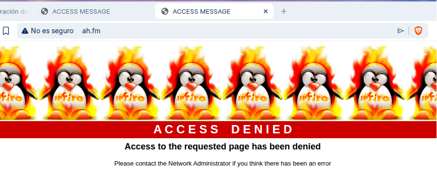

## Filtrat de dominis i URLs 

El següent que farem serà un llistat de dominis i URLs. En aquest cas, bloquejarem el domini elnacional.cat i tecnocampus.cat. Serà important activar la llista negra personalitzada perquè sinó no tindrà efecte. I reiniciarem el proxy perquè els canvis tinguin efecte.

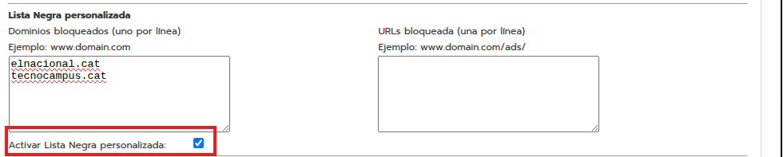

Podrem veure que el domini elnacional.cat està bloquejat i tecnocampus.cat també està bloquejat.

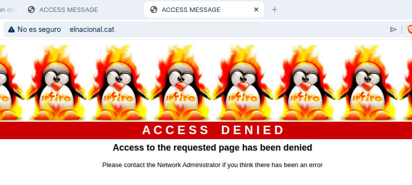

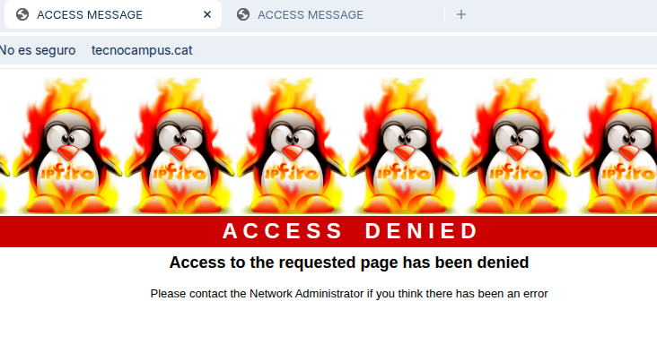

Ara bloquejarem una URL concreta, que és la de www.business.google.com/es/google-ads. I reiniciarem el proxy perquè els canvis tinguin efecte.

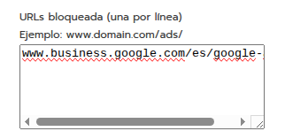

Veurem que està bloquejada la URL de Google Ads.

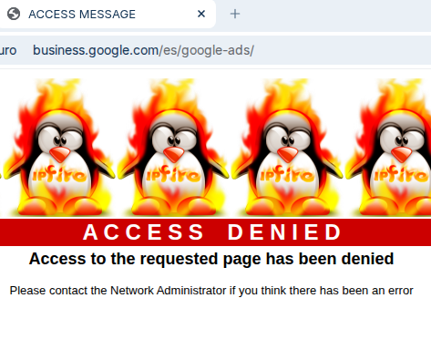

## Filtrat de paraules i exclusions (Anime) 

Ara filtrarem per paraules. En aquest cas, bloquejarem la paraula "anime". Però deixarem la pàgina de animenetwork.com en les llistes blanques perquè ens deixi entrar. I serà important activar les llistes blanques personalitzades i les de frases personalitzades. I reiniciarem el proxy perquè els canvis tinguin efecte.

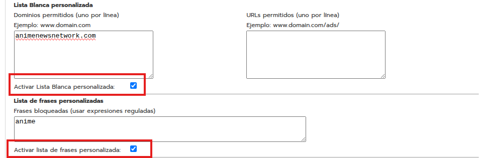

Veurem una pàgina de anime i no ens deixa que està bloquejada per la paraula anime, però sí que entrem a animenetwork.com sí que ens deixa entrar.

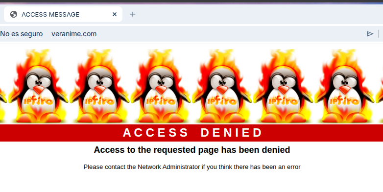

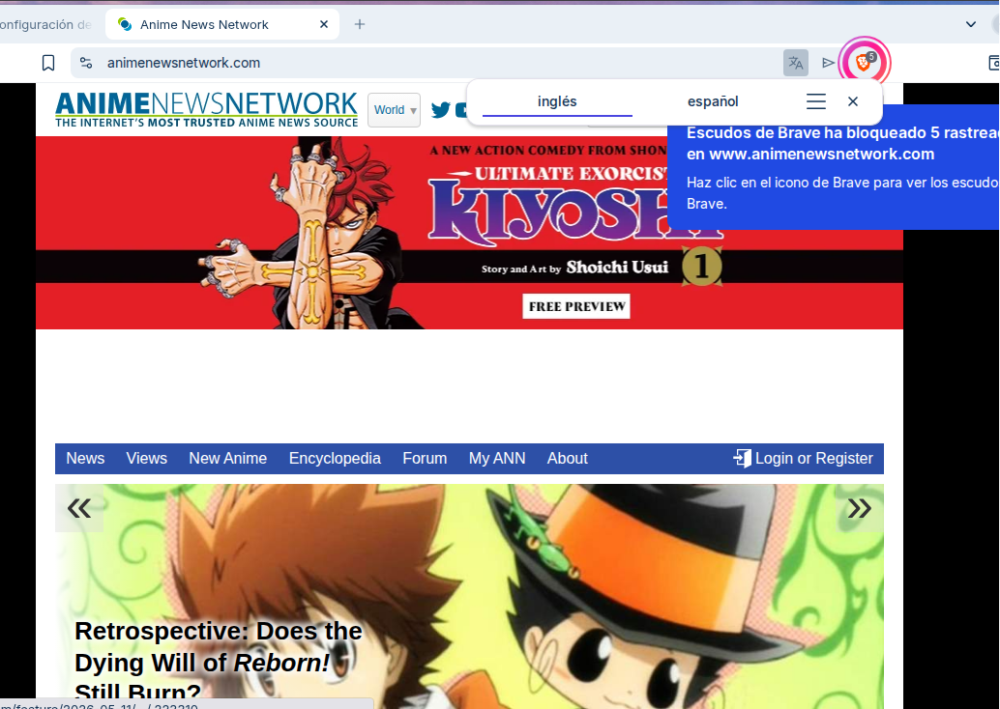

## Control horari 

Per últim farem el control horari. Haurem d'entrar a l'apartat de control horari i configurar les hores en les que volem que el proxy bloquegi les pàgines. En aquest cas, bloquejarem les pàgines 24 hores, totes les pàgines estaran bloquejades. I reiniciarem el proxy perquè els canvis tinguin efecte.

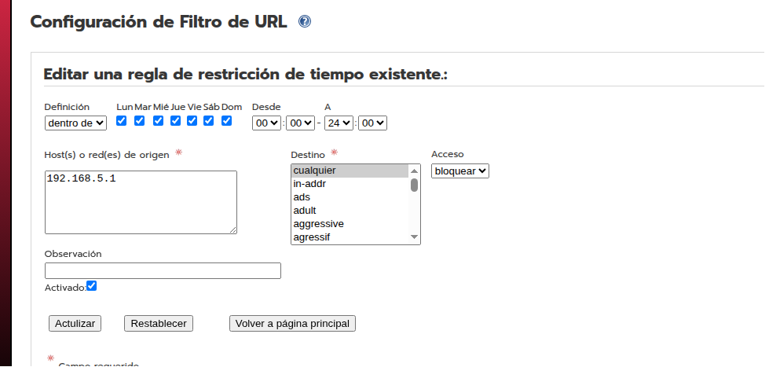

Aqui podem veure que hem creat una regla de control horari. 

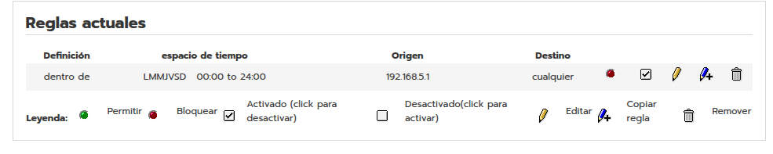

Entrem en qualsevol pàgina i veiem que està bloquejada pel control horari.

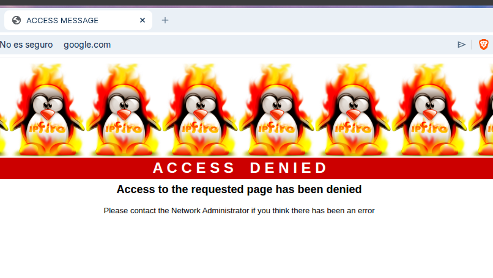

- [Enllaç del README](README.md)